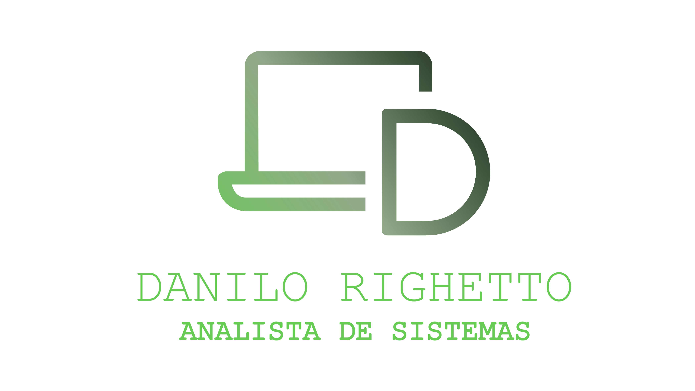

<h1 align="center">
    
</h1>

<p align="center">
  <a href="#-cursos">Cursos</a>&nbsp;&nbsp;&nbsp;|&nbsp;&nbsp;&nbsp;
    <a href="#-ide">IDE</a>&nbsp;&nbsp;&nbsp;|&nbsp;&nbsp;&nbsp;
  <a href="#-tecnologias">Tecnologias</a>&nbsp;&nbsp;&nbsp;|&nbsp;&nbsp;&nbsp;
  <a href="#-projeto">Projeto</a>&nbsp;&nbsp;&nbsp;|&nbsp;&nbsp;&nbsp;
  <a href="#memo-licença">Licença</a>&nbsp;&nbsp;&nbsp;|&nbsp;&nbsp;&nbsp;
  <a href="#-author">Author</a>
</p>

<p align="center">
 

  
</p>

<br>

<p align="center">
  
</p>

# Curso - Rocketseat Starter

Rocketseat é uma plataforma de educação de desenvolvedores focada em novas tecnologias.

Veja mais em: [Rocketseat Starter](https://rocketseat.com.br/)

## 🤘 Cursos

- Javascript ES6: `COMPLETE`
- Javascript: `IN PROGRESS`
- NodeJS: `IN PROGRESS`
- ReactJS: `IN PROGRESS`
- React Native: `IN PROGRESS`

## 💪 IDE

Visual Studio Code - [Download](https://code.visualstudio.com/Download)

Configurações

```json
{
  "editor.minimap.enabled": false,
  "javascript.updateImportsOnFileMove.enabled": "always",
  "editor.tabSize": 2,
  "editor.fontSize": 14,
  "editor.lineHeight": 24,
  "editor.fontFamily": "Fira Code",
  "editor.fontLigatures": true,
  "files.autoSave": "off",
  "workbench.colorTheme": "Dracula"
}
```

`Extensões` do visual studio code:

- [Theme Dracula](https://marketplace.visualstudio.com/items?itemName=dracula-theme.theme-dracula)
- [Material Icon Theme](https://marketplace.visualstudio.com/items?itemName=PKief.material-icon-theme)
- [Rocketseat ReactJS](https://marketplace.visualstudio.com/items?itemName=rocketseat.RocketseatReactJS)
- [Rocketseat React Native](https://marketplace.visualstudio.com/items?itemName=rocketseat.RocketseatReactNative)
- [FiraCode](https://github.com/tonsky/FiraCode)

## 🚀 Tecnologias

Esse projeto foi desenvolvido com as seguintes tecnologias:

- [NODEJS](https://nodejs.org/en/)
- [REACTJS](https://pt-br.reactjs.org)

## 💻 Projeto

O projeto visa o aprendizado do **NODEJS** e do **REACTJS** 💜

## :memo: Licença

Esse projeto está sob a licença MIT. Veja o arquivo [LICENSE](LICENSE.md) para mais detalhes.

## Author

[Danilo Righetto - Analista de Sistemas](https://github.com/danilo-righetto)

| Social   | Links                                                                      |
| -------- | -------------------------------------------------------------------------- |
| Github   | <a href="https://github.com/danilo-righetto">danilo-righetto</a>           |
| Linkedin | <a href="https://www.linkedin.com/in/danilo-righetto/">danilo-righetto</a> |
| Facebook | <a href="https://www.facebook.com/danilo.righeto">danilo.righetto</a>      |
| Twitter  | <a href="https://twitter.com/danilorighetto">danilorighetto</a>            |
